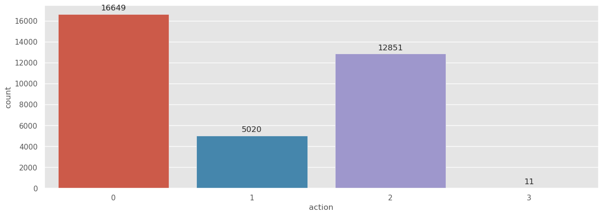

# Actions-classification-task-Firewall-logs-in-Cybersecurity

---


<p style="text-align:center">
    <a href="https://skills.network/?utm_medium=Exinfluencer&utm_source=Exinfluencer&utm_content=000026UJ&utm_term=10006555&utm_id=NA-SkillsNetwork-Channel-SkillsNetworkQuickLabsClassification_evaluation_security_dataset_L227201964-2022-01-01" target="_blank">
    
    </a>
</p>


# **Action classification task based on Internet Firewall logs**


The purpose of this lab is to build the best classifier in the security area based on Internet Firewall DataSet with the helping frameworks & libraries.

After completing this lab you will

1.  Be able to explore the Internet Firewall DataSet and build the best classifier via selecting from a set of existed classifiers.
2.  Be able to show different calculated metrics of existed classifiers.
3.  Be able to visualize the data analysis results with various plot types.


## Agenda


*   Theory and Methods
*   General part
    *   Import required libraries and dataset
    *   Explore the Dataset
    *   Form a set of classifiers and fit them
    *   Metrics calculation and choice better classifier
    *   Visualization of results
*   Tasks
*   Author


***


## Theory and Methods


The data that we are going to use for this is a subset of an open source default of Internet Firewall DataSet from the UCI ML repository: [https://archive.ics.uci.edu/ml/citation_policy.html](https://archive.ics.uci.edu/ml/citation_policy.html?utm_medium=Exinfluencer&utm_source=Exinfluencer&utm_content=000026UJ&utm_term=10006555&utm_id=NA-SkillsNetwork-Channel-SkillsNetworkQuickLabsClassification_evaluation_security_dataset_L227201964-2022-01-01).

> This dataset is public available for research. The details are described in \[Fatih Ertam, fatih.ertam '@' firat.edu.tr, Firat University, Turkey].

Please include this citation if you plan to use this database:
F. Ertam and M. Kaya, Classification of firewall log files with multiclass support vector machine, in 6th International Symposium on Digital Forensic and Security, ISDFS 2018 - Proceeding, 2018.

During the work, you will know about the [classification task](https://en.wikipedia.org/wiki/Statistical_classification?utm_medium=Exinfluencer&utm_source=Exinfluencer&utm_content=000026UJ&utm_term=10006555&utm_id=NA-SkillsNetwork-Channel-SkillsNetworkQuickLabsClassification_evaluation_security_dataset_L227201964-2022-01-01#Algorithms) is the main machine learning task solved by an algorithm correlating some input data with one or more classes, which must be defined earlier. In essence, classification can be used as a tool for many other tasks, such as automatic language detection, 3D-reconstruction, etc.

Moreover, you will be provided `11` well-known classifiers. You should select a better classifier among them. Some of them need enough more time for learning by `.fit` method, so you can select not all classifiers, but, for instance, 5 or 6 will be enough.

Classification refers to a supervised learning strategy, also called supervised or guided learning.

A classification task is often referred to as predicting a categorical dependent variable (i.e. a dependent variable that is a category) based on a sample of continuous and / or categorical variables.

In addition, we will build the visualization of our results, exactly the obtained metrics (accuracy and loss) to choose a better classifier.


## Import required libraries and dataset


Download data using a URL and rename it.


```python
!wget https://archive.ics.uci.edu/ml/machine-learning-databases/00542/log2.csv
```

    --2025-02-17 19:08:08--  https://archive.ics.uci.edu/ml/machine-learning-databases/00542/log2.csv
    Resolving archive.ics.uci.edu (archive.ics.uci.edu)... 128.195.10.252, 128.195.10.252
    Connecting to archive.ics.uci.edu (archive.ics.uci.edu)|128.195.10.252|:443... connected.
    HTTP request sent, awaiting response... 200 OK
    Length: unspecified
    Saving to: ‘log2.csv’
    
    log2.csv                [   <=>              ]   2.74M  4.92MB/s    in 0.6s    
    
    2025-02-17 19:08:09 (4.92 MB/s) - ‘log2.csv’ saved [2876998]
    


Alternative URL for downloading of the dataset.


```python
!wget https://cf-courses-data.s3.us.cloud-object-storage.appdomain.cloud/Classification_evaluation_security_dataset_L2/log2.csv
```

    --2025-02-17 19:08:14--  https://cf-courses-data.s3.us.cloud-object-storage.appdomain.cloud/Classification_evaluation_security_dataset_L2/log2.csv
    Resolving cf-courses-data.s3.us.cloud-object-storage.appdomain.cloud (cf-courses-data.s3.us.cloud-object-storage.appdomain.cloud)... 169.63.118.104, 169.63.118.104
    Connecting to cf-courses-data.s3.us.cloud-object-storage.appdomain.cloud (cf-courses-data.s3.us.cloud-object-storage.appdomain.cloud)|169.63.118.104|:443... connected.
    HTTP request sent, awaiting response... 200 OK
    Length: 2811465 (2.7M) [text/csv]
    Saving to: ‘log2.csv.1’
    
    log2.csv.1          100%[===================>]   2.68M  --.-KB/s    in 0.04s   
    
    2025-02-17 19:08:14 (69.7 MB/s) - ‘log2.csv.1’ saved [2811465/2811465]
    


Import needed libraries to use in this lab. We can add some aliases (such as pd, plt, np, sns) to make the libraries easier to use in code and set a default figure size for further plots. Ignore warnings too.


```python
!pip install scikit-plot
!pip install imblearn
```

    Collecting scikit-plot
      Downloading scikit_plot-0.3.7-py3-none-any.whl (33 kB)
    Requirement already satisfied: matplotlib>=1.4.0 in /home/jupyterlab/conda/envs/python/lib/python3.7/site-packages (from scikit-plot) (3.5.3)
    Requirement already satisfied: scikit-learn>=0.18 in /home/jupyterlab/conda/envs/python/lib/python3.7/site-packages (from scikit-plot) (0.20.1)
    Requirement already satisfied: scipy>=0.9 in /home/jupyterlab/conda/envs/python/lib/python3.7/site-packages (from scikit-plot) (1.7.3)
    Collecting joblib>=0.10 (from scikit-plot)
      Downloading joblib-1.3.2-py3-none-any.whl (302 kB)
         ━━━━━━━━━━━━━━━━━━━━━━━━━━━━━━━━━━━━━━ 302.2/302.2 kB 31.2 MB/s eta 0:00:00
    [?25hRequirement already satisfied: cycler>=0.10 in /home/jupyterlab/conda/envs/python/lib/python3.7/site-packages (from matplotlib>=1.4.0->scikit-plot) (0.11.0)
    Requirement already satisfied: fonttools>=4.22.0 in /home/jupyterlab/conda/envs/python/lib/python3.7/site-packages (from matplotlib>=1.4.0->scikit-plot) (4.38.0)
    Requirement already satisfied: kiwisolver>=1.0.1 in /home/jupyterlab/conda/envs/python/lib/python3.7/site-packages (from matplotlib>=1.4.0->scikit-plot) (1.4.4)
    Requirement already satisfied: numpy>=1.17 in /home/jupyterlab/conda/envs/python/lib/python3.7/site-packages (from matplotlib>=1.4.0->scikit-plot) (1.21.6)
    Requirement already satisfied: packaging>=20.0 in /home/jupyterlab/conda/envs/python/lib/python3.7/site-packages (from matplotlib>=1.4.0->scikit-plot) (23.1)
    Requirement already satisfied: pillow>=6.2.0 in /home/jupyterlab/conda/envs/python/lib/python3.7/site-packages (from matplotlib>=1.4.0->scikit-plot) (8.1.0)
    Requirement already satisfied: pyparsing>=2.2.1 in /home/jupyterlab/conda/envs/python/lib/python3.7/site-packages (from matplotlib>=1.4.0->scikit-plot) (3.0.9)
    Requirement already satisfied: python-dateutil>=2.7 in /home/jupyterlab/conda/envs/python/lib/python3.7/site-packages (from matplotlib>=1.4.0->scikit-plot) (2.8.2)
    Requirement already satisfied: typing-extensions in /home/jupyterlab/conda/envs/python/lib/python3.7/site-packages (from kiwisolver>=1.0.1->matplotlib>=1.4.0->scikit-plot) (4.5.0)
    Requirement already satisfied: six>=1.5 in /home/jupyterlab/conda/envs/python/lib/python3.7/site-packages (from python-dateutil>=2.7->matplotlib>=1.4.0->scikit-plot) (1.16.0)
    Installing collected packages: joblib, scikit-plot
    Successfully installed joblib-1.3.2 scikit-plot-0.3.7
    Collecting imblearn
      Downloading imblearn-0.0-py2.py3-none-any.whl (1.9 kB)
    Collecting imbalanced-learn (from imblearn)
      Downloading imbalanced_learn-0.12.4-py3-none-any.whl (258 kB)
         ━━━━━━━━━━━━━━━━━━━━━━━━━━━━━━━━━━━━━━ 258.3/258.3 kB 19.1 MB/s eta 0:00:00
    [?25hRequirement already satisfied: numpy>=1.17.3 in /home/jupyterlab/conda/envs/python/lib/python3.7/site-packages (from imbalanced-learn->imblearn) (1.21.6)
    Requirement already satisfied: scipy>=1.5.0 in /home/jupyterlab/conda/envs/python/lib/python3.7/site-packages (from imbalanced-learn->imblearn) (1.7.3)
    Collecting scikit-learn>=1.0.2 (from imbalanced-learn->imblearn)
      Downloading scikit_learn-1.0.2-cp37-cp37m-manylinux_2_17_x86_64.manylinux2014_x86_64.whl (24.8 MB)
         ━━━━━━━━━━━━━━━━━━━━━━━━━━━━━━━━━━━━━━━━ 24.8/24.8 MB 56.4 MB/s eta 0:00:0000:0100:01
    [?25hRequirement already satisfied: joblib>=1.1.1 in /home/jupyterlab/conda/envs/python/lib/python3.7/site-packages (from imbalanced-learn->imblearn) (1.3.2)
    Collecting threadpoolctl>=2.0.0 (from imbalanced-learn->imblearn)
      Downloading threadpoolctl-3.1.0-py3-none-any.whl (14 kB)
    Installing collected packages: threadpoolctl, scikit-learn, imbalanced-learn, imblearn
      Attempting uninstall: scikit-learn
        Found existing installation: scikit-learn 0.20.1
        Uninstalling scikit-learn-0.20.1:
          Successfully uninstalled scikit-learn-0.20.1
    Successfully installed imbalanced-learn-0.12.4 imblearn-0.0 scikit-learn-1.0.2 threadpoolctl-3.1.0


```python
import pandas as pd
import os
import matplotlib.pyplot as plt
import numpy as np
import seaborn as sns
import scikitplot as sk
from collections import Counter
from sklearn.model_selection import StratifiedKFold
from sklearn import *
import time

%matplotlib inline
sns.set(style = "darkgrid")
plt.rcParams['figure.figsize'] = (15, 5)
plt.style.use('ggplot')
seed = 42

import warnings
warnings.filterwarnings(action = "ignore", category = FutureWarning)
```

As well as specify the value of the `precision` parameter equal to 3 to display three decimal signs (instead 6 as default).


```python
pd.set_option("precision", 3)
pd.options.display.float_format = '{:.3f}'.format
```

## Explore the Dataset


In this section you will explore the sourse dataset.


Let's read the data and look at the first 5 rows using the `head` method. The count of the output rows from the dataset is determined by the `head` method parameter.


```python
df = pd.read_csv('log2.csv', header = 0)
df.head(5)
```


<div>
<style scoped>
    .dataframe tbody tr th:only-of-type {
        vertical-align: middle;
    }

    .dataframe tbody tr th {
        vertical-align: top;
    }

    .dataframe thead th {
        text-align: right;
    }
</style>
<table border="1" class="dataframe">
  <thead>
    <tr style="text-align: right;">
      <th></th>
      <th>Source Port</th>
      <th>Destination Port</th>
      <th>NAT Source Port</th>
      <th>NAT Destination Port</th>
      <th>Action</th>
      <th>Bytes</th>
      <th>Bytes Sent</th>
      <th>Bytes Received</th>
      <th>Packets</th>
      <th>Elapsed Time (sec)</th>
      <th>pkts_sent</th>
      <th>pkts_received</th>
    </tr>
  </thead>
  <tbody>
    <tr>
      <th>0</th>
      <td>57222</td>
      <td>53</td>
      <td>54587</td>
      <td>53</td>
      <td>allow</td>
      <td>177</td>
      <td>94</td>
      <td>83</td>
      <td>2</td>
      <td>30</td>
      <td>1</td>
      <td>1</td>
    </tr>
    <tr>
      <th>1</th>
      <td>56258</td>
      <td>3389</td>
      <td>56258</td>
      <td>3389</td>
      <td>allow</td>
      <td>4768</td>
      <td>1600</td>
      <td>3168</td>
      <td>19</td>
      <td>17</td>
      <td>10</td>
      <td>9</td>
    </tr>
    <tr>
      <th>2</th>
      <td>6881</td>
      <td>50321</td>
      <td>43265</td>
      <td>50321</td>
      <td>allow</td>
      <td>238</td>
      <td>118</td>
      <td>120</td>
      <td>2</td>
      <td>1199</td>
      <td>1</td>
      <td>1</td>
    </tr>
    <tr>
      <th>3</th>
      <td>50553</td>
      <td>3389</td>
      <td>50553</td>
      <td>3389</td>
      <td>allow</td>
      <td>3327</td>
      <td>1438</td>
      <td>1889</td>
      <td>15</td>
      <td>17</td>
      <td>8</td>
      <td>7</td>
    </tr>
    <tr>
      <th>4</th>
      <td>50002</td>
      <td>443</td>
      <td>45848</td>
      <td>443</td>
      <td>allow</td>
      <td>25358</td>
      <td>6778</td>
      <td>18580</td>
      <td>31</td>
      <td>16</td>
      <td>13</td>
      <td>18</td>
    </tr>
  </tbody>
</table>
</div>


### Let's look at the dataset size, feature names and their types


```python
df.shape
```


    (65532, 12)


The dataset contains `65 532` objects (rows), for each of which `12` features are set (columns), including 1 target feature (`Action`).


### Attribute Information


Output the column (feature) names:


```python
df.columns
```


    Index(['Source Port', 'Destination Port', 'NAT Source Port',
           'NAT Destination Port', 'Action', 'Bytes', 'Bytes Sent',
           'Bytes Received', 'Packets', 'Elapsed Time (sec)', 'pkts_sent',
           'pkts_received'],
          dtype='object')


Input features (column names):

1.  `Source Port` - a port, from which data transfer has been carried out
2.  `Destination Port` - a port, to which data transfer has been carried out
3.  `NAT Source Port` - a port, which needs to track for outgoing traffic from NAT (Network Address Translation) side to retransfer transit packets
4.  `NAT Destination Port` - a port, which needs to track for incoming traffic from NAT (Network Address Translation) side to retransfer transit packets
5.  `Action` - a feature (desired target), which is used as a class, 4 classes in total (`allow`, `deny`, `drop`, and `reset-both`)
6.  `Bytes` - bytes total, is equal to the sum of the next two columns
7.  `Bytes Sent` - the amount of data sent in bytes
8.  `Bytes Received` - the amount of data received in bytes
9.  `Packets` – packets total, is equal to the sum of the last two columns
10. `Elapsed Time (sec)` - time taken to transfer data in seconds
11. `pkts_sent` - the amount of data sent in packets
12. `pkts_received` - the amount of data received in packets


To see general information on the all dataframe features (columns), we use the **`info`** method:


```python
df.info()
```

    <class 'pandas.core.frame.DataFrame'>
    RangeIndex: 65532 entries, 0 to 65531
    Data columns (total 12 columns):
     #   Column                Non-Null Count  Dtype 
    ---  ------                --------------  ----- 
     0   Source Port           65532 non-null  int64 
     1   Destination Port      65532 non-null  int64 
     2   NAT Source Port       65532 non-null  int64 
     3   NAT Destination Port  65532 non-null  int64 
     4   Action                65532 non-null  object
     5   Bytes                 65532 non-null  int64 
     6   Bytes Sent            65532 non-null  int64 
     7   Bytes Received        65532 non-null  int64 
     8   Packets               65532 non-null  int64 
     9   Elapsed Time (sec)    65532 non-null  int64 
     10  pkts_sent             65532 non-null  int64 
     11  pkts_received         65532 non-null  int64 
    dtypes: int64(11), object(1)
    memory usage: 6.0+ MB


As you can see, the dataset is full, no pass (`non-null`), so there is no need to fill the skippings. The dataset contains 11 integer (`int64`) and 1 object (`object`) features.


Method **`describe`** shows the main statistical characteristics of the dataset for each numerical feature (`int64` type): existing values count, mean, standard deviation, range, min & max, 0.25, 0.5 and 0.75 quartiles. Will show the obtained results in transposed view for better perception.


```python
df.describe().T
```


<div>
<style scoped>
    .dataframe tbody tr th:only-of-type {
        vertical-align: middle;
    }

    .dataframe tbody tr th {
        vertical-align: top;
    }

    .dataframe thead th {
        text-align: right;
    }
</style>
<table border="1" class="dataframe">
  <thead>
    <tr style="text-align: right;">
      <th></th>
      <th>count</th>
      <th>mean</th>
      <th>std</th>
      <th>min</th>
      <th>25%</th>
      <th>50%</th>
      <th>75%</th>
      <th>max</th>
    </tr>
  </thead>
  <tbody>
    <tr>
      <th>Source Port</th>
      <td>65532.000</td>
      <td>49391.969</td>
      <td>15255.713</td>
      <td>0.000</td>
      <td>49183.000</td>
      <td>53776.500</td>
      <td>58638.000</td>
      <td>65534.000</td>
    </tr>
    <tr>
      <th>Destination Port</th>
      <td>65532.000</td>
      <td>10577.386</td>
      <td>18466.027</td>
      <td>0.000</td>
      <td>80.000</td>
      <td>445.000</td>
      <td>15000.000</td>
      <td>65535.000</td>
    </tr>
    <tr>
      <th>NAT Source Port</th>
      <td>65532.000</td>
      <td>19282.973</td>
      <td>21970.690</td>
      <td>0.000</td>
      <td>0.000</td>
      <td>8820.500</td>
      <td>38366.250</td>
      <td>65535.000</td>
    </tr>
    <tr>
      <th>NAT Destination Port</th>
      <td>65532.000</td>
      <td>2671.050</td>
      <td>9739.162</td>
      <td>0.000</td>
      <td>0.000</td>
      <td>53.000</td>
      <td>443.000</td>
      <td>65535.000</td>
    </tr>
    <tr>
      <th>Bytes</th>
      <td>65532.000</td>
      <td>97123.950</td>
      <td>5618438.909</td>
      <td>60.000</td>
      <td>66.000</td>
      <td>168.000</td>
      <td>752.250</td>
      <td>1269359015.000</td>
    </tr>
    <tr>
      <th>Bytes Sent</th>
      <td>65532.000</td>
      <td>22385.797</td>
      <td>3828138.650</td>
      <td>60.000</td>
      <td>66.000</td>
      <td>90.000</td>
      <td>210.000</td>
      <td>948477220.000</td>
    </tr>
    <tr>
      <th>Bytes Received</th>
      <td>65532.000</td>
      <td>74738.153</td>
      <td>2463207.712</td>
      <td>0.000</td>
      <td>0.000</td>
      <td>79.000</td>
      <td>449.000</td>
      <td>320881795.000</td>
    </tr>
    <tr>
      <th>Packets</th>
      <td>65532.000</td>
      <td>102.866</td>
      <td>5133.002</td>
      <td>1.000</td>
      <td>1.000</td>
      <td>2.000</td>
      <td>6.000</td>
      <td>1036116.000</td>
    </tr>
    <tr>
      <th>Elapsed Time (sec)</th>
      <td>65532.000</td>
      <td>65.834</td>
      <td>302.462</td>
      <td>0.000</td>
      <td>0.000</td>
      <td>15.000</td>
      <td>30.000</td>
      <td>10824.000</td>
    </tr>
    <tr>
      <th>pkts_sent</th>
      <td>65532.000</td>
      <td>41.400</td>
      <td>3218.871</td>
      <td>1.000</td>
      <td>1.000</td>
      <td>1.000</td>
      <td>3.000</td>
      <td>747520.000</td>
    </tr>
    <tr>
      <th>pkts_received</th>
      <td>65532.000</td>
      <td>61.467</td>
      <td>2223.332</td>
      <td>0.000</td>
      <td>0.000</td>
      <td>1.000</td>
      <td>2.000</td>
      <td>327208.000</td>
    </tr>
  </tbody>
</table>
</div>


The `Mean` row shows the feature average,`  STD ` is a RMS (Root Mean Square) deviation, `min`,`  max ` - minimum and maximum values, `25%`, `50%`, ` 75%  `- quarters that split the dataset (or part of it) into four groups containing approximately an equal number of observations (rows). For example, the average elapsed time for data transfer (`Elapsed Time (sec)`) is a bit more than one minute (`65.834` seconds).


In general, according to the data, it is impossible to say that there are [outliers](https://en.wikipedia.org/wiki/Outlier?utm_medium=Exinfluencer&utm_source=Exinfluencer&utm_content=000026UJ&utm_term=10006555&utm_id=NA-SkillsNetwork-Channel-SkillsNetworkQuickLabsClassification_evaluation_security_dataset_L227201964-2022-01-01) in the data. However, such an inspection is not enough, it is desirable to still see the charts of the dependence of the target feature from each feature, but you can do it later yourself, when you will visualize features and dependencies.


Because we have only one object (type `object`) feature, let check and show the unique values of its.


```python
[df[i].unique() for i in df if df[i].dtypes == "object"]
```


    [array(['allow', 'drop', 'deny', 'reset-both'], dtype=object)]


As you can see the feature (desired target) really has 4 classes (`allow`, `drop`, `deny`, `reset-both`), as it has shown earlier.

The next our step is to convert to lowercase all column names and change gaps between words to sign `_` for better perception and for the convenience of further work with the Internet Firewall DataSet.


```python
df.columns = df.columns.str.lower().str.replace(" ","_")
df.head(7)
```


<div>
<style scoped>
    .dataframe tbody tr th:only-of-type {
        vertical-align: middle;
    }

    .dataframe tbody tr th {
        vertical-align: top;
    }

    .dataframe thead th {
        text-align: right;
    }
</style>
<table border="1" class="dataframe">
  <thead>
    <tr style="text-align: right;">
      <th></th>
      <th>source_port</th>
      <th>destination_port</th>
      <th>nat_source_port</th>
      <th>nat_destination_port</th>
      <th>action</th>
      <th>bytes</th>
      <th>bytes_sent</th>
      <th>bytes_received</th>
      <th>packets</th>
      <th>elapsed_time_(sec)</th>
      <th>pkts_sent</th>
      <th>pkts_received</th>
    </tr>
  </thead>
  <tbody>
    <tr>
      <th>0</th>
      <td>57222</td>
      <td>53</td>
      <td>54587</td>
      <td>53</td>
      <td>allow</td>
      <td>177</td>
      <td>94</td>
      <td>83</td>
      <td>2</td>
      <td>30</td>
      <td>1</td>
      <td>1</td>
    </tr>
    <tr>
      <th>1</th>
      <td>56258</td>
      <td>3389</td>
      <td>56258</td>
      <td>3389</td>
      <td>allow</td>
      <td>4768</td>
      <td>1600</td>
      <td>3168</td>
      <td>19</td>
      <td>17</td>
      <td>10</td>
      <td>9</td>
    </tr>
    <tr>
      <th>2</th>
      <td>6881</td>
      <td>50321</td>
      <td>43265</td>
      <td>50321</td>
      <td>allow</td>
      <td>238</td>
      <td>118</td>
      <td>120</td>
      <td>2</td>
      <td>1199</td>
      <td>1</td>
      <td>1</td>
    </tr>
    <tr>
      <th>3</th>
      <td>50553</td>
      <td>3389</td>
      <td>50553</td>
      <td>3389</td>
      <td>allow</td>
      <td>3327</td>
      <td>1438</td>
      <td>1889</td>
      <td>15</td>
      <td>17</td>
      <td>8</td>
      <td>7</td>
    </tr>
    <tr>
      <th>4</th>
      <td>50002</td>
      <td>443</td>
      <td>45848</td>
      <td>443</td>
      <td>allow</td>
      <td>25358</td>
      <td>6778</td>
      <td>18580</td>
      <td>31</td>
      <td>16</td>
      <td>13</td>
      <td>18</td>
    </tr>
    <tr>
      <th>5</th>
      <td>51465</td>
      <td>443</td>
      <td>39975</td>
      <td>443</td>
      <td>allow</td>
      <td>3961</td>
      <td>1595</td>
      <td>2366</td>
      <td>21</td>
      <td>16</td>
      <td>12</td>
      <td>9</td>
    </tr>
    <tr>
      <th>6</th>
      <td>60513</td>
      <td>47094</td>
      <td>45469</td>
      <td>47094</td>
      <td>allow</td>
      <td>320</td>
      <td>140</td>
      <td>180</td>
      <td>6</td>
      <td>7</td>
      <td>3</td>
      <td>3</td>
    </tr>
  </tbody>
</table>
</div>


Let's check the balancing of the feature (desired target). The following function `Counter` from the `collections` framework can be used for this action as more convenient.


```python
Counter(df.action)
```


    Counter({'allow': 37640, 'drop': 12851, 'deny': 14987, 'reset-both': 54})


As you can see, our feature (desired target) is imbalanced (amount `allow` > `deny` > `drop` > `reset-both`), but we will solve this issue.

The following actions (encoding, dropping, cutting by quantiles range, selecting of required "clean" subset, resampling, splitting to train and test sets, and scaling) help you to prepare your dataset for usage for the classifiers.


```python
from imblearn.over_sampling import SMOTE

# to encode our feature (desired target)
lab = preprocessing.LabelEncoder()
df.action = lab.fit_transform(df.action)

# create new dataframe without our feature (desired target)
data_out = df.drop("action", axis = 1)

# define 1st and 3rd quantiles, interquartile range and outlier step (1.5 interquartile range) 
# form a needed range for a selecting required "clean" subset without outliers accordance to Tukey method
quant_1 = data_out.quantile(0.25)
quant_3 = data_out.quantile(0.75)
diff = quant_3 - quant_1
data = df[~((df < (quant_1 - 1.5 * diff)) |(df > (quant_3 + 1.5 * diff))).any(axis = 1)]
```

Indicate the shape size of the new dataset & count the observations amount of each class.

Replace `##YOUR CODE GOES HERE##` with python code.


```python
##YOUR CODE GOES HERE##
```

Double-click **here** for the solution.

<!-- 
data.shape, Counter(data.action)
-->


In addition, will show a histogram distribution of the observations amount of each class. Let's use the SMOTE function to make the classes in balanced. The SMOTE function does the oversampling on the minority class.


```python
fig = sns.countplot(data.action)
for p in fig.patches:
    fig.annotate(format(p.get_height(), '.0f'), 
                   (p.get_x() + p.get_width() / 2., p.get_height()), 
                   ha = 'center', va = 'center', 
                   xytext = (0, 9), size = 12,
                   textcoords = 'offset points')
```


    

    


Will select `feature` and `target` variables, based on which you will split our new dataset into subsets for future training.


```python
feature, target = data.drop("action", axis = 1).values, data["action"].values
sm = SMOTE(random_state = seed)
feature, target = sm.fit_resample(feature, target)
```

After using SMOTE function (i.e. the over-sampling method) all classes are same and good to make prediction on it. This method also allows to avoid over-fitting issues. Let's check the observations amount of each class and answer (based on `target` variable) the question "Is our dataset balanced now?"

Replace `##YOUR CODE GOES HERE##` with python code.


```python
##YOUR CODE GOES HERE##
```

Double-click **here** for the solution.

<!-- 
Counter(target)
-->


Let's split our dataset with a proportion: test set = `30%`, train set = `70%` (these values can be chosen depends on task and some other factors). Also, will use `shuffle` function of the samples to have always a random order of samples fed to the network. Set the seed to a constant value so that the random reordering is reproducible.


```python
xtrain, xtest, ytrain, ytest = model_selection.train_test_split(feature, target,
                                                                test_size = 0.3,
                                                                random_state = seed,
                                                                stratify = target,
                                                                shuffle = True)
```

Indicate the shape size of all split datasets.

Replace `##YOUR CODE GOES HERE##` with python code.


```python
##YOUR CODE GOES HERE##
```

Double-click **here** for the solution.

<!-- 
xtrain.shape, xtest.shape, ytrain.shape, ytest.shape
-->


Further, we need to make scaling. Method `StandardScaler` transforms your data (train and test sets) in such a way that its distribution will have a mean of 0 and a standard deviation of 1. Thus this method normalizes or standardizes your data individually, independently for each column. This is useful when you want to compare data for different measurement units.


```python
xtrain = preprocessing.StandardScaler().fit_transform(xtrain)
xtest = preprocessing.StandardScaler().fit_transform(xtest)
```

## Form a set of classifiers and fit them


Will describe `11` well-known classifiers with some minimal parameters. Some of them are commented out, so you should uncomment by rows only those, which you want to study. Thus, you can select not all classifiers, but, for instance, `5` or `6` will be enough.

Besides, the approximate execution time is shown at the right in a row with classifier description. If you will obtain the following message "Warning: Variables are collinear", then never mind, because this Lab has not an aim to eliminate this warning.


```python
AUTOTUNE = os.cpu_count()
Classifiers = {
    "Linear_Regressor": linear_model.LogisticRegression(C = 10, solver = 'liblinear'),  ## duration is less than 1 min
    # "SVC": svm.SVC(random_state = seed),  ## duration is about 10 min
    # "Linear_SVC": svm.LinearSVC(max_iter = 10000, random_state = seed),  ## duration is about 4 min
    "Random_Forest": ensemble.RandomForestClassifier(random_state = seed, n_jobs = AUTOTUNE),  ## duration is about 1-2 min
    "Ada_Boost": ensemble.AdaBoostClassifier(tree.DecisionTreeClassifier(random_state = seed),
                                             random_state = seed,
                                             learning_rate = 0.1),  ## duration is about 2 min
    # "Gradient_Boost": ensemble.GradientBoostingClassifier(random_state = seed),  ## duration is about 10 min
    "Ex_Tree_Classifier": ensemble.ExtraTreesClassifier(random_state = seed, n_jobs = AUTOTUNE),  ## duration is about 1-2 min
    # "ML_PC": neural_network.MLPClassifier(max_iter = 1000, random_state = seed),  ## duration is about 20 min
    "kNN": neighbors.KNeighborsClassifier(n_jobs = AUTOTUNE),  ## duration is about 2-3 min
#     "QDA": discriminant_analysis.QuadraticDiscriminantAnalysis(reg_param = np.finfo(float).eps),  ## duration is less than 1 min
    "Decision_Tree": tree.DecisionTreeClassifier(random_state = seed)  ## duration is less than 1 min
}
```

Let's visualize the learning process. You should use the `plot_learning_curve` function, which cross-validates all of your data. Let set the parameter `cv` = `kfold`, it means stratified 10-fold strategy of splitting cross-validations.


```python
start_time = time.time()
kfold = StratifiedKFold(n_splits = 10)
for name, classifier in Classifiers.items():
    sk.estimators.plot_learning_curve(classifier, xtrain, ytrain,
                                      cv = kfold,
                                      title = name,
                                      random_state = seed,
                                      n_jobs = -1)
print("Elapsed time:", round(time.time() - start_time, 2), 'sec\n')
```

The graphs visualize the `learning curves` of the chosen models for both training and test (validation) sets as the size of the training set increases. The shaded area of the learning curve represents the uncertainty of that curve (measured as `standard deviation`). The model is evaluated on both training and test sets using the coefficient of determination `R2`.


## Metrics calculation and choice better classifier


Let's teach our set of classifiers (which you selected earlier) wuth the help of `fit` method. After each fitting stage, we will calculate some metrics, which helps us to chose the best classifier for the further optimization. We will use the following metrics: `train & test accuracy`, `log_loss`, and numbers of `correct` and `incorrect` cases of a predict from our models (classifiers).


```python
from sklearn.metrics import log_loss

start_time = time.time()
logging_cols=["Classifier", "Test accuracy", "Train accuracy", "Log_loss", "Correct_cases", "Incorrect_cases"]
logging = pd.DataFrame(columns = logging_cols)

for name_c , classif_c in Classifiers.items():
    classif_c.fit(xtrain, ytrain)
    predict = classif_c.predict(xtest)
    accuracy = classif_c.score(xtest, ytest)
    train_pred = classif_c.predict_proba(xtest)
    lg_ls = log_loss(ytest, train_pred)
    train_test_acc = classif_c.score(xtrain, ytrain)
    correct = (ytest == predict).sum()
    incorrect = (ytest != predict).sum()
    
    print("="*45)
    print('****    Estimations    ****')
    print(f"Test accuracy:  {accuracy*100:.2f}%    Name: {name_c}")
    print(f"Train accuracy:  {train_test_acc*100:.2f}%")
    print(f"Log_loss:  {lg_ls:.4f}")
    print(f"Correct   points:  {correct}")
    print(f"Incorrect points:  {incorrect}")
    sk.metrics.plot_confusion_matrix(ytest, predict, title = name_c, cmap = plt.cm.Greens)
    logging_entry = pd.DataFrame([[name_c, accuracy*100, train_test_acc*100, lg_ls, correct, incorrect]], columns = logging_cols)
    logging = logging.append(logging_entry)
print("\nElapsed time:", round(time.time() - start_time, 2), 'sec\n')
```

You should show the DataFrame with all calculated metrics.

Replace `##YOUR CODE GOES HERE##` with python code.


```python
##YOUR CODE GOES HERE##
```

Double-click **here** for the solution.

<!-- 
logging
-->


## Visualization of results


Let's visualize calculated metrics with the same classifiers that to get a chance to choose the best classifier. These visualizations can help us to understand classifiers achievements and compare them more clearly. We will do this for the `accuracy` metric.


```python
sns.set_color_codes("muted")
graph = sns.barplot(x = 'Classifier',
                    y = 'Test accuracy',
                    data = logging,          
                    palette = 'hls')

for p in graph.patches:
    graph.annotate(format(p.get_height(), '.2f'), 
                   (p.get_x() + p.get_width() / 2., p.get_height()), 
                   ha = 'center', va = 'center', 
                   xytext = (0, -12), size = 12,
                   textcoords = 'offset points')

plt.xlabel('\nClassifier`s name')
plt.title('Estimations (Test accuracy) of the classifiers')
plt.show()

sns.set_color_codes("muted")
graph = sns.barplot(x = 'Classifier',
                    y = 'Train accuracy',
                    data = logging,          
                    palette = 'hls')

for p in graph.patches:
    graph.annotate(format(p.get_height(), '.2f'), 
                   (p.get_x() + p.get_width() / 2., p.get_height()), 
                   ha = 'center', va = 'center', 
                   xytext = (0, -12), size = 12,
                   textcoords = 'offset points')

plt.xlabel('\nClassifier`s name')
plt.title('Estimations (Train accuracy) of the classifiers')
plt.show()
```

After selection of the best or a set of the best classifiers, you can go to the next stage is hyperparameters optimization, but it is a topic of the further Lab.


## Tasks


You should build the same visualizations, but only for the `Log_loss`, `Correct_cases`, `Incorrect_cases` metrics.

Replace `##YOUR CODE GOES HERE##` with python code.


```python
##YOUR CODE GOES HERE##
```

Double-click **here** for the solution.

<!-- 
sns.set_color_codes("muted")
graph = sns.barplot(x = 'Classifier',
                    y = 'Log_loss',
                    data = logging,          
                    palette = 'hls')

for p in graph.patches:
    graph.annotate(format(p.get_height(), '.2f'), 
                   (p.get_x() + p.get_width() / 2., p.get_height()), 
                   ha = 'center', va = 'center', 
                   xytext = (0, -12), size = 12,
                   textcoords = 'offset points')

plt.xlabel('\nClassifier`s name')
plt.title('Estimations (Log_loss) of the classifiers')
plt.show()

graph = sns.barplot(x = 'Classifier',
                    y = 'Correct_cases',
                    data = logging,          
                    palette = 'hls')

for p in graph.patches:
    graph.annotate(format(p.get_height(), '.2f'), 
                   (p.get_x() + p.get_width() / 2., p.get_height()), 
                   ha = 'center', va = 'center', 
                   xytext = (0, -12), size = 12,
                   textcoords = 'offset points')

plt.xlabel('\nClassifier`s name')
plt.title('Estimations (Correct_cases) of the classifiers')
plt.show()

graph = sns.barplot(x = 'Classifier',
                    y = 'Incorrect_cases',
                    data = logging,          
                    palette = 'hls')

for p in graph.patches:
    graph.annotate(format(p.get_height(), '.2f'), 
                   (p.get_x() + p.get_width() / 2., p.get_height()), 
                   ha = 'center', va = 'center', 
                   xytext = (0, -12), size = 12,
                   textcoords = 'offset points')

plt.xlabel('\nClassifier`s name')
plt.title('Estimations (Incorrect_cases) of the classifiers')
plt.show()
-->


## Authors


[Sergii Kavun](https://www.linkedin.com/in/sergii-kavun/?utm_medium=Exinfluencer&utm_source=Exinfluencer&utm_content=000026UJ&utm_term=10006555&utm_id=NA-SkillsNetwork-Channel-SkillsNetworkQuickLabsClassification_evaluation_security_dataset_L227201964-2022-01-01)


## Change Log


| Date (YYYY-MM-DD) | Version | Changed By    | Change Description   |
| ----------------- | ------- | ------------- | -------------------- |
| 2021-07-08        | 1.0     | Kavun, Sergii | Code improving       |
| 2021-06-07        | 0.21    | Kavun, Sergii | Code refactoring     |
| 2021-06-02        | 0.2     | Kavun, Sergii | Translate to english |
| 2021-06-01        | 0.1     | Kavun, Sergii | Created Lab          |


Copyright © 2021 IBM Corporation. All rights reserved.

